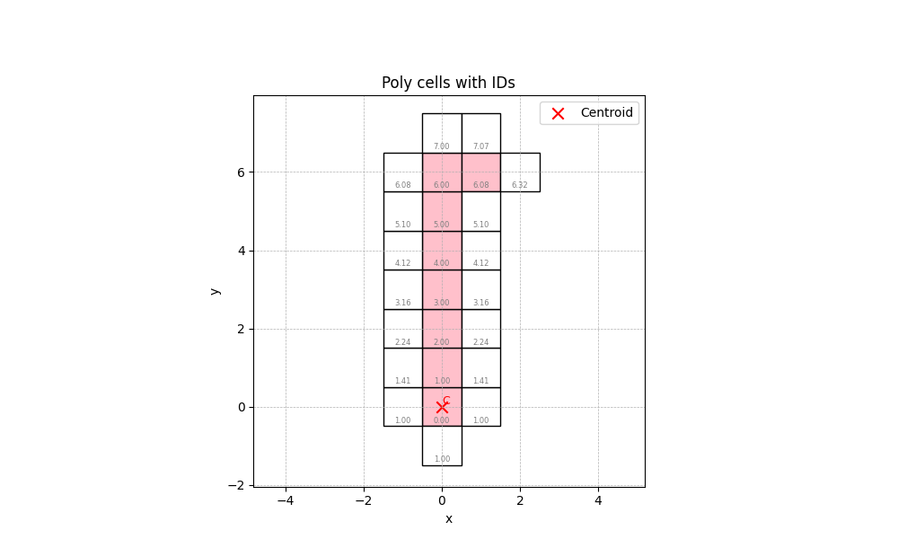

# Counting Polyomino

## Overview

**Counting Polyomino** is a C++ project dedicated to the **enumeration** and **performance analysis** of polyominoes.

> **Polyominoes**: Connected shapes formed by joining unit squares edge-to-edge.

The Philosophy:

Rather than just implementing a "*textbook*" algorithm,
this project bridges the gap between **algorithmic theory** (generation, symmetry, and counting)
and **systems engineering** (cache-friendly memory layouts, multithreading, and assembly-level optimization) **from scratch**.

The ultimate goal isn't just a high cell count

it's to master performance engineering and advanced C++ paradigms.

Example image for **$\text{Trivial Group}\rightarrow \text{\{e\}}$ Polyomino** with 8 cells (Rotation 0, Reflection 0):




---

## What This Project Does

At a high level, the project:

- Enumerates polyominoes of increasing order (number of cells)
- Eliminates duplicates caused by **translation, rotation, and reflection**
- Analyzes structural properties of generated polyominoes
- Compares different enumeration and counting strategies
- Generates data and visual representations for further study

This makes the project suitable for:
- Algorithm research / experimentation
- Performance engineering practice
- Learning advanced C++

---

## Current Progress

### Stage 1:

Goal:
* Understand the basic process to produce free Polyomino
* Research and desgin **memory encoding** of Polyomino
* Development first version of enumeration model
* Focus on **correctness** that preformance
* Generate dataset and try to analyse property of Polyomino

Outcome:
* Comprefend basic Polyomino background like:
  * $\text{Fixed Polyomino}, \text{ Chiral Polyomino}, \text{ Free Polyomino}$
  * $\text{Equivalences}$ like $\text{Translation}, \text{ Rotation}, \text{ Reflection}$
  * $\text{Lexicographic ordering of cell}$
* Design the model as iteration of `generate new Polyomino => remove duplication Polyomino`
* Developed enumeration model `Poly_Int_Pair_v1.hpp` with `Poly_Int_Pair_v1.cpp`
* Developed analysis module `PolyominoAnalyse.hpp` with `PolyominoAnalyse.hpp`, focus on **distribution**
* Improve use of `Makefile` and C++ compilers like `g++, clang`

### Stage 2:

Goal:
* Dive into intriguing properties behide Polyomino
* Improve **performance** of enumeration model with **benchmarking** and **testing**
* Explore of possibility of **Rotation Invariant enumeration model**

Outcome:
* Discover relationship between $\text{Symmetry of Polyomino}$ and $\text{Duplicated \& Unique Child of Polyomino}$
* Improve enumeration model by memorization, utilised algorithm & data structure
* Developed benchmark framework `timing.hpp`
* Developed enumeration model `Poly_Int_Pair_v2.hpp` with `Poly_Int_Pair_v2.cpp`
* Developed test case `Testcase_Int_Pair_v2.hpp` with `Testcase_Int_Pair_v2.cpp`
* Developed python visualization `Draw_Polyomino.py` //Where the images came from

### Stage 3 (On Going):

Goal:
* Improve **performance** of enumeration model from Stage 2
* Explore C++ **concurrent and parallelism**
* Continue exploration of **Rotation Invariant enumeration model**
* Investigate possibility of **Uniform Hashing Method** for Free Polyomino
* Learning performance critical tool like `perf` //because perf, I switch from Window to Linux

Outcome:
* Analyse model's behaviour and bottleneck with `perf stat, record, report`
* Developing enumeration model `Poly_Int_Pair_v3.hpp` with `Poly_Int_Pair_v3.cpp`
* Experimenting concurrent and parallelism in C++

### Stage 4 (Future):

Goal:
* Parallise the enumeration model
* Explore other memory encoding
---

## Project Structure

```txt

Counting_Polyomino/
├── Header/                # Core implementation
├── PolyominoEnumerate/    # Enumeration
├── PolyominoAnalyse/      # Analysis and statistics
├── PolyominoImage/        # Shape visualization utilities
├── Draw_Polyomino.py      # Python helper for rendering polyominoes
├── CSV_Data/              # Generated datasets
├── UnitSpeedCompare/      # Performance benchmarks
├── SmallTest/             # External experiment
├── text/                  # Notes and documentation

```

---

## Performance Focus

A major aspect of this project is **measuring and understanding performance**:

- Comparison between:
  - Data structure and Algorithm
  - Library usage
  - Object encoding
- Investigation of:
  - CPU utility like (vectorised asm, pipling, branch prediction, cache effect...)
  - Better Data structure and Algorithm
  - Performance measure and comparison
  - C++ tooling and optimizations

 ---

## Performance Comparison*

**N** = number of cells, **Time Unit** = MS

Compiler OPT flag = `-03, -march=native, -flto`

Stage 1 `Poly_Int_Pair_v1`:
* N = 9,  5605,   5702,   5659
* N = 10, 88291,  88789,  88301

Reflection:
* Use of `std::set` as main container
  * Node base container create huge cache locality problem
* Use $O(N^2)$ algorithm to remove duplications
  * Compare by iteration with `==`
  * Two free poly need $8 \cdot N$ iterations
  * Generate hash value or `memcmp()` will be better
* Did not store the `empty cell`
  * Need $O(N)$ with hash table to construct `empty cells`

<br>

Stage 2 `Poly_Int_Pair_v2`:
* N = 9,  29,   35,   32
* N = 10, 97,   103,  109
* N = 11, 400,  408,  417
* N = 12, 1743, 1750, 1763
* N = 13, 7558, 7565, 7569

Reflection:
* Use of `Boost flat_set (vector)` as main container
  * Utilise prefetcher with branchless loading
  * Less frequent memory allocation //with `reserve()`
* Use of Symmetry to generate unqiue child directly without duplication
* Use $O(N)$ algorithm with `Boost unordered_node_map` to remove duplications
  * Compare with `memcmp`
  * Generate hash value with `xxhash`
* Store `empty cell` with obj
  * No construction for `empty cell` needed
* Most hot path functions do vectorised with v256 //Reading asm

Improvement:
* Only store 1 Fixed Polyomino in memory
  * Still need to generate 7 permutated Polyominoes
* `Boost flat_set` create branching and memory shifting
  * When `insert(), search()...`
* Possible to optimise memory access patterns
 ---

## Build and Run (Example)

```c++
//main.cpp

//Require std c++20, Boost unordered_node_map, unordered_flat_map, flat_set
#include "../Header/Poly_Int_Pair_v2.hpp"
#include "../Header/Timing.hpp"

void generate(const int num_cells){
    using namespace int_pair_v2;

    Polyomino_class all(num_cells);
    //generate all free polyominoes from 1 to num_cells

    all.print_num();
    //print the number of free polyominoes for each number of cell
    //and print the number of hash for each number of cell

    //all.print();
    //print all the free polyominoes for each cumber of cell
    //and print all the hash value for each cumber of cell
}

int main(void){
    const int num_cells = 10;
    timing::measure(generate, num_cells);
    //also print the time used to generate free poly
}
```

```bash
cd ./PolyominoEnumerate
make run
```
**Example Output**

```txt
PolyominoEnumerate: $ make run
g++ -std=c++20 -Wall -Wextra -Wpedantic -O3 -march=native -flto=auto       -I../Header/ -c main.cpp -o main.o
g++ -std=c++20 -Wall -Wextra -Wpedantic -O3 -march=native -flto=auto       -I../Header/ ../Header/Obj_Speed/Poly_Int_Pair_v1.o ../Header/Obj_Speed/Poly_Int_Pair_v2.o ../Header/Obj_Speed/Poly_Int_Pair_v3.o main.o -o main
./main

Num cell = 1	# Poly = 1
Num cell = 2	# Poly = 1
Num cell = 3	# Poly = 2
Num cell = 4	# Poly = 5
Num cell = 5	# Poly = 12
Num cell = 6	# Poly = 35
Num cell = 7	# Poly = 108
Num cell = 8	# Poly = 369
Num cell = 9	# Poly = 1285
Num cell = 10	# Poly = 4655

Num cell = 1	# hash = 1
Num cell = 2	# hash = 2
Num cell = 3	# hash = 6
Num cell = 4	# hash = 19
Num cell = 5	# hash = 63
Num cell = 6	# hash = 216
Num cell = 7	# hash = 760
Num cell = 8	# hash = 2725
Num cell = 9	# hash = 9910
Num cell = 10	# hash = 36446

Duration = 100MS

```
---

## Example Benchmark code and output:
```c++
#include "../Header/Testcase_Int_Pair_v2.hpp"

constexpr std::size_t DATA_SIZE = 10000;
constexpr std::size_t REPEAT = 10000;


int main(){
    std::ios_base::sync_with_stdio(false);
    std::cin.tie(NULL);
    // std::srand(std::time(NULL));

    auto p = test_case::prepare_product_poly_d2_1(DATA_SIZE);
    auto testing = [&](){
        return test_case::generate_unique_child2(p);
    };

    timing::benchmark_result<test_case::unit_t> result 
        = timing::benchmark<test_case::unit_t>(testing, REPEAT);
    result.result_print(false, DATA_SIZE);
    result.histogram();
    return 0;
}
```
```txt
./main

Total runtime = 877004909	Repeat time = 10000	Mask = 0
Measure in NS	Data size = 10000
	Mean (Total time / # Record) = 87700
	Mode (Most common pattern) = 82732
	Percentile_X (Item >= X% of Item)
		P50 = 86792	P90 = 94924	P95 = 98651
	Range -> (Max - Min) = 296834 -> (370284 - 73450)
	Result Mask = 0
[73450,84866.7) ######################################################################## 3886
[84866.7,96283.4) #################################################################################################### 5341
[96283.4,107700) ########## 587
[107700,119117)  44
[119117,130533)  45
[130533,141950) # 64
[141950,153367)  15
[153367,164784)  7
[164784,176200)  6
[176200,187617)  2
[187617,199034)  0
[199034,210450)  0
[210450,221867)  0
[221867,233284)  0
[233284,244700)  2
[244700,256117)  0
[256117,267534)  0
[267534,278950)  0
[278950,290367)  0
[290367,301784)  0
[301784,313201)  0
[313201,324617)  0
[324617,336034)  0
[336034,347451)  0
[347451,358867)  0
[358867,370284)  1
```
